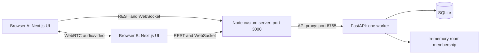
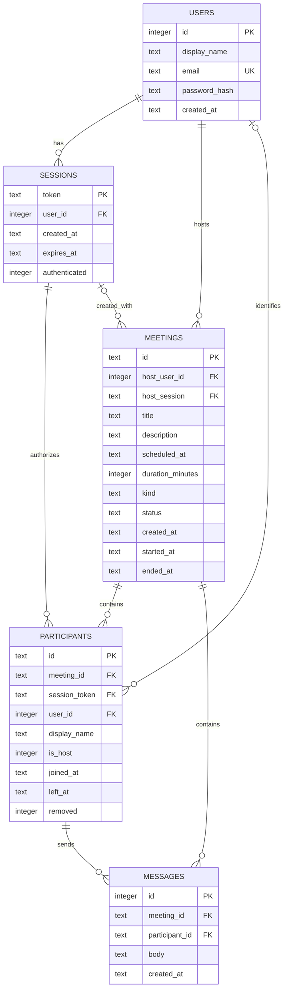
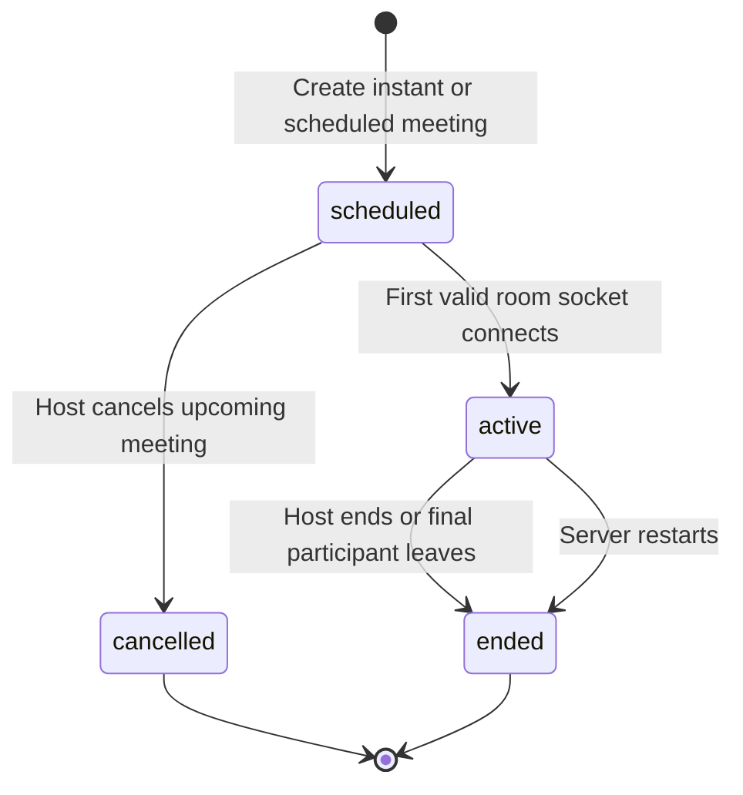
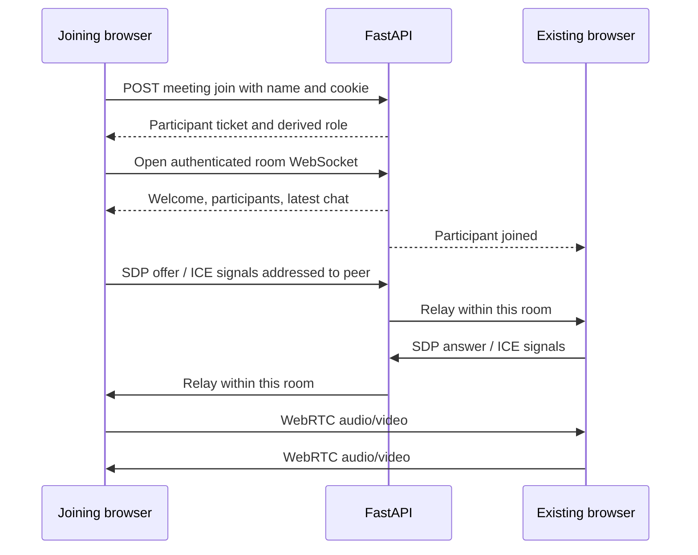

# Architecture and database

The app runs one Next.js custom HTTP server and one FastAPI process. Browsers use one origin for pages, REST, and WebSocket signaling. WebRTC carries media directly between participants, or through a configured TURN relay when a direct connection is unavailable.

## Responsibilities

| Location | Responsibility |
| --- | --- |
| `app/` | Public, account, Workplace, and meeting routes; layout and stylesheet entry points |
| `components/Landing.tsx` | Public marketing navigation, feature carousel/tabs, search, and guest joining |
| `components/AuthProvider.tsx` | Current account, signup/login/logout calls, and cross-tab account refresh |
| `components/AuthForm.tsx` | Account form steps, validation, errors, and safe return-to-meeting navigation |
| `components/Dashboard.tsx` | Account-specific meetings, agenda/search, profile/settings, and meeting actions |
| `components/MeetingDialogs.tsx` | Join, schedule, and invitation workflows |
| `components/MeetingRoom.tsx` | Preview, room layout, controls, chat, participants, and leaving |
| `components/Modal.tsx` | Dialog focus trapping, Escape/backdrop handling, and focus restoration |
| `lib/api.ts` | Typed API helper, error handling, invitation parsing, clipboard utilities |
| `lib/useMeeting.ts` | Capture streams, signaling, peer negotiation, remote tracks, and media cleanup |
| `backend/main.py` | Account/meeting REST endpoints and server-authorized room messages |
| `backend/security.py` | Password hashing, session cookies, request-origin checks, and login throttling |
| `backend/database.py` | Schema, migrations, seeding, transactions, and meeting ID generation |
| `backend/rooms.py` | Connected sockets and transient participant/media state |
| `scripts/run.mjs` / `scripts/server.mjs` | Process supervision and same-origin HTTP/WebSocket proxy |

## Schema

`participants.user_id` is nullable for guests. A participant row records one join/attendance instance; a person may have multiple rows after reconnecting. `participant_count` in the meeting list counts recorded joins, rather than the current number of live sockets.

Guest sessions retain `user_id=1` for compatibility with the original default-user schema, but have `authenticated=0`; application identity resolves to `None`, and guest participant rows have no user ID. The seed user ID therefore grants no host privileges. `meetings.host_session` is retained as creation metadata; ownership uses `host_user_id` and survives sign-out/sign-in.

Each database operation owns its connection and transaction. Foreign keys are enabled per connection; SQLite uses WAL. Parameterized queries handle user input. Constraints enforce unique emails, 11-character meeting IDs, meeting kind/status, host flags, and 15–480 minute durations. Indexes support schedules, ownership, attendance, and chat retrieval.

## Meeting lifecycle

Instant meetings use the current UTC time; future meetings require an explicit timezone. The browser converts its datetime picker value to UTC and displays times in the viewer's timezone. Duration is scheduling metadata, not an automatic room timeout. A scheduled meeting can start early, and its host can leave while other participants continue. Ended/cancelled rooms cannot be reopened.

First initialization creates the demo account and five meetings only when the meetings table is empty. Startup migrations add missing authentication columns without deleting existing data. Startup also closes stale attendance and active meetings because live sockets cannot survive a process restart.

## Account and room authorization

Passwords are salted PBKDF2-SHA256 hashes with 600,000 iterations. Each successful signup/login creates a random session token in an HttpOnly, SameSite=Lax cookie. HTTPS enables the Secure flag. Default expiry is one day; Stay signed in uses 30 days. Login rotates the old token, and logout revokes the session and closes its connected room sockets.

Authenticated account identity controls meeting creation, listing, cancellation, and host actions. The list includes meetings the account owns or attended while signed in. Public invitations allow a guest to obtain meeting details and create a participant ticket tied to their browser cookie. Opening the WebSocket requires that ticket, its matching unexpired session, and an open meeting. Host authority is derived from account ownership, not from names, invite links, or client flags.

Browser mutations validate the origin against the request/proxy host; WebSockets also check their origin. Invalid password attempts are throttled after ten failures per IP/email over a minute in the single server process. This is a local account implementation, without third-party OAuth, email verification, or password recovery.

## WebRTC and signaling

New joiners initiate peer connections. Perfect negotiation uses deterministic polite/impolite peers to handle offer collisions; ICE candidates wait for a remote description. The answering side reuses offered transceivers to avoid duplicate video tracks. Screen sharing replaces the video sender track and retains audio. Incoming renegotiated tracks replace the previous track of the same kind.

Chat and attendance persist in SQLite. The server delivers the most recent 100 chat messages to new joiners. Live media/raised-hand state and signaling sockets remain in memory. Leaving, removal, session expiry, and logout release peer connections and capture tracks in the browser.

The mesh is suitable for small groups. Run one FastAPI worker; scaling needs shared room/pub-sub infrastructure and would benefit from an SFU. Host mute is an authorized command honored by the client; a modified peer cannot be muted at a media server because this implementation has no media server. Removal blocks the same browser session or signed-in account from rejoining; an anonymous visitor using an entirely new session is not a verified person identity.
