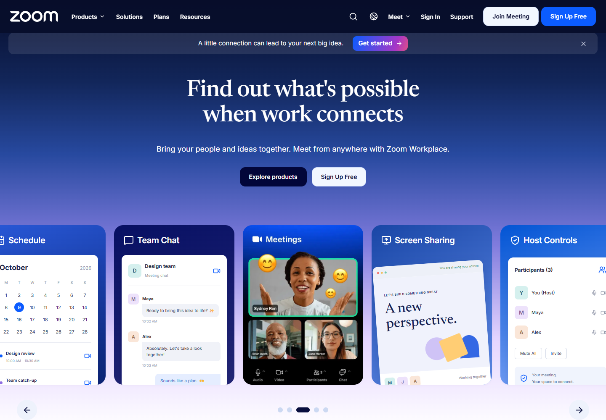
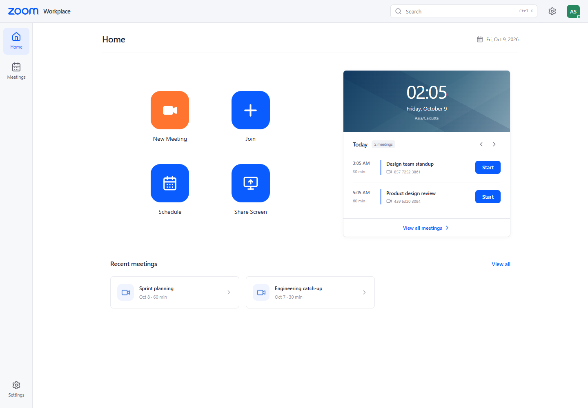
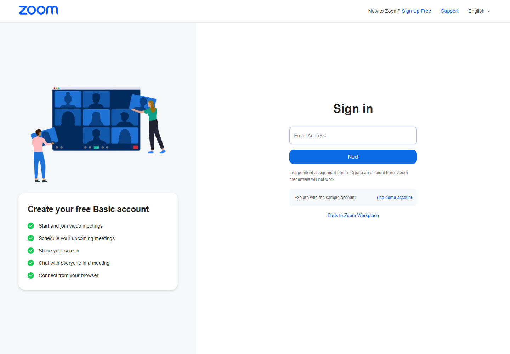
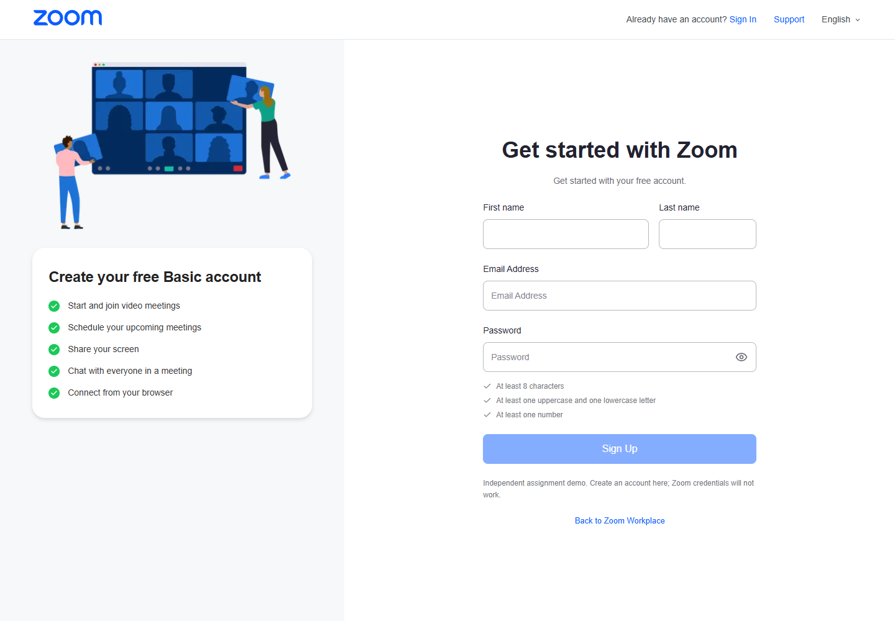
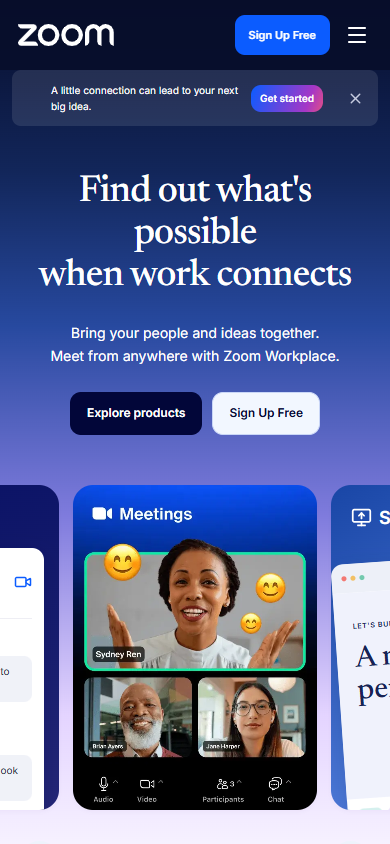
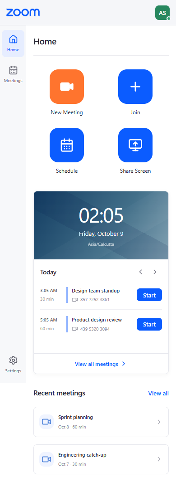

# Application screenshots

Captured from the local production build with a separate, freshly seeded SQLite database. These show this application, rather than official Zoom screenshots. The full capture script is `scripts/capture.mjs`.

## Public landing page

## Workplace dashboard

## Sign in

## Sign up

## Mobile layouts

| Public homepage | Account dashboard |
| --- | --- |
|  |  |

Desktop captures use a 1440px viewport; mobile captures use 390px. See [validation](VALIDATION.md) for additional widths and [references](REFERENCES.md) for product/artwork attribution.
